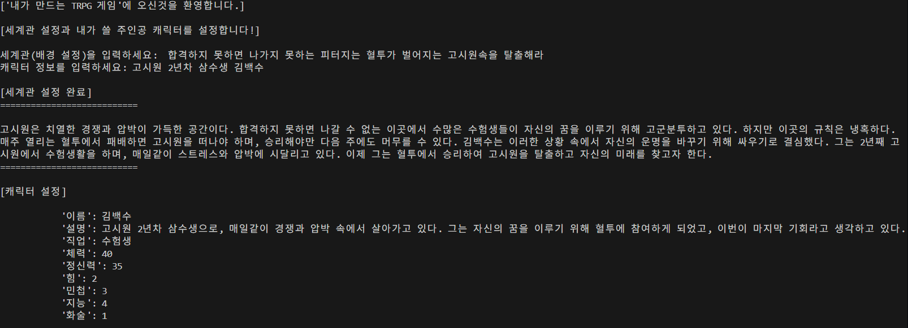
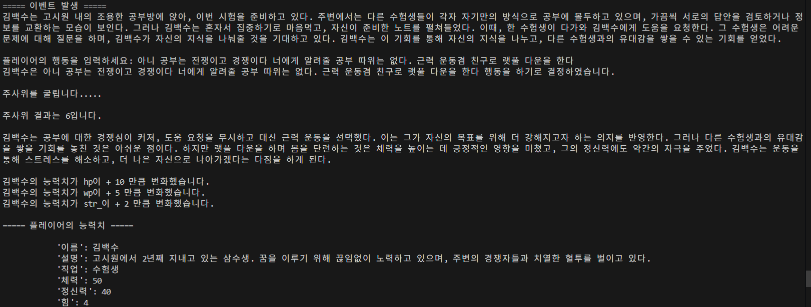
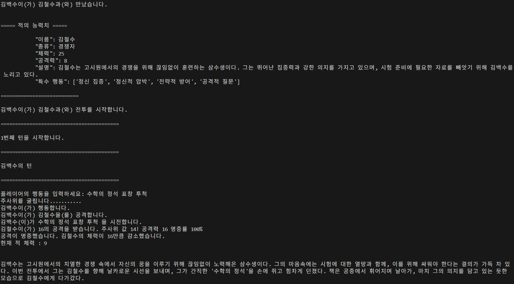
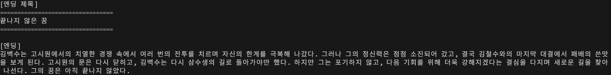

#  나와 AI가 만들어 가는 TRPG

## 🔖 프로젝트 개요

"나와 AI가 만들어 가는 TRPG"는 LLM (Large Language Model)을 활용하여 게임 마스터(Game Master)를 대체하며, 1인용 텍스트 구조의  TRPG(Tabletop Role-Playing Game)를 구현한 프로젝트입니다.

> 플레이어는 자신이 행할 행동을 텍스트로 입력하고, 큰 틀과 1d12 주사위 구조 위에서 게임을 진행하며, AI는 플레이어의 행동을 분석하여 알맞는 상황과 묘사를 제공합니다.

---

## TRPG란?
* TRPG(Tabletop Role-Playing Game)는 플레이어들이 각자 캐릭터가 되어, 정해진 틀 속에서 주사위, 규칙서, 그리고 상상력을 바탕으로 상황극처럼 이야기와 전투를 만들어가는 게임이다. 게임에는 크게 두 가지 역할이 존재한다.

* **플레이어**: 각자 캐릭터를 조종하며 이야기 속에서 선택과 행동을 담당한다.

* **게임 마스터(GM)**: 세계를 설명하고, 규칙을 적용하며, 전체 흐름을 이끌어가는 역할이다.
이 중 게임 마스터는 단 한 명이 맡는 경우가 대부분이며,
그 기량에 따라 게임의 몰입도와 재미가 극명하게 달라진다.
하지만 그만큼 가장 어렵고 부담이 큰 역할이기도 하여, 직접 맡아줄 사람을 찾는 것이 쉽지 않다.
---

## 📈 개발 목표

- **LLM(대형 언어 모델)을 이용해
게임 마스터 역할을 대신하게 하고,
플레이어는 상황만 입력하면 TRPG를 컴퓨터로 즐길 수 있게 만든다.**

- 게임 마스터(GM)의 역할을 LLM으로 대체
- 1인용, 텍스트 구조의 TRPG 게임 구현
- TRPG에 입문하기 어려운 사람들에게 접근성을 높임
---

## 💡 주 타겟층

- 여러가지 이유로 게임 마스터를 구할 수 없는 사람들
- 사람들을 모아서 진행하는 정적인 진행 방식이 아닌 개인적으로 혼자서 TRPG를 즐기고자 하는 사람들
- 호기심이 가득한 입문자, 그리고 혼자도 게임을 즐겨보고 싶은 사람

---

## 개발 방법

- 사용자 인터페이스 : CLI 환경
- 개발 언어 : 
- 개발 IDE : VSCode 
- 사용 API : OpenAI API

## 📚 파일 계층 구조
* 프로젝트의 확장성을 높이기 위한 모듈화
```
project
├── main.py        # 게임 실행 처리
├── system/         # 게임내 주된 기능을 담당하는 모듈
├── llm/           # LLM 연계 파일 및 프롬프트 모듈
├── model/         # 플레이어 캐릭터, 적 등 객체와 상호작용 모듈
├── data/          # 게임 로그 관리 파일
```
---


## 🛸 주요 시스템 개요

### 1. 게임 구조
- 사용자의 텍스트 입력을 기반으로 LLM을 이용한 게임 배경 구성
- 자유로운 상황 선택과 턴 전투를 통해서 자신의 캐릭터를 성장시키며 목표에 도달

### 2. 플레이 방식
- 기존의 게임과 다른 사용자가 직접 텍스트를 입력하여 행동하는 텍스트 입력 기반 게임 플레이 방식
- 1d12 주사위 값과 캐릭터의 주 능력치를 이용한 게임 진행
- 처해진 상황 속에서 사용자의 행동과 전투를 통해서 게임의 목표에 도달한다.

### 3. 내부 작동 방식
1. **게임 로그 기반 상황 생성**
* LLM이 현재까지의 게임 로그를 분석하여, 플레이어가 처한 새로운 상황을 자세히 묘사하고 출력한다.
2. **플레이어 행동 입력**
* 미리 정해진 선택지가 아니라, 플레이어가 자유롭게 텍스트로 행동을 입력한다.
3. **행동 파싱 및 수치화**
* 입력한 행동을 LLM이 파싱하여 어떤 능력치(stat)를 사용할지 판단하고, 내부 함수를 통해 수치화하여 JSON 형식으로 반환한다.
4. **객체에 적용 및 상태 변화**
* 수치화된 JSON 데이터를 기반으로 플레이어나 적 객체에 능력치 변화를 적용한다.
5. **상태 변화 묘사**
* 변동된 수치를 다시 LLM에 전달하여, 상황에 맞는 스토리형 텍스트로 자연스럽게 묘사한다.

### 4. LLM의 기능과 범위
- 플레이어에게 받은 텍스트를 해석하여 구조화된 JSON으로 변환
- 시스템속 상호작용으로 인한 수치적 변화를 생동감 있게 상황을 묘사
- **시스템 내부 객체간의 연산 자체는 관여하지 않는다.**
- LLM의 기능을 게임 내부까지 사용하면 사용자가 재미를 느낄 수 있는 게임의 상황을 넘어간다.
ex) 게임오버가 명확한데 계속 작위적으로 계속 살려줌, 게임 플레이어가 프롬프트를 수정해야하는 상황이 계속 나옴
- 구조화된 틀 안에서 LLM을 사용함으로써 사용자는 게임만 즐길 수 있게 만듬
---

## 프롬프트 예시

- 지금까지 로그를 기반으로 상황에 어울리는 적의 능력치를 JSON으로 넘겨주는 프롬프트


## 주된 작동 방식

### 게임 설정, 플레이어 생성

1. 사용자의 입력을 LLM을 통해 어울리는 배경과 플레이어를 생성해줌

### 선택지 입력과 상호작용

1. 사용자의 입력을 통해 텍스트를 받음
2. 해당 이벤트가 어떤 능력치에 영향을 줄지 LLM이 판단
3. LLM이 능력치별 변화량을 수치데이터로 파싱
4. 내부적으로 반영 후 LLM이 결과를 텍스트데이터로 묘사

### 적과의 전투

1. 지금까지의 로그와 배경을 기반으로 적을 생성
2. 턴제식의 전투 시작
    1. 공격방식을 사용자의 입력으로 받음
    2. LLM이 해당 공격이 어떤 능력치와 관련이 있는지 판단
    3. 사용헌 주사위 수치, 능력치 기반 보정치를 내부적으로 연산식에 적용하여 적에게 공격하여 적의 수치를 변화
    4. 해당 수치 변화를 LLM에 전달 수치변화에 따른 결과를 텍스트로 묘사

### 엔딩

1. 지금까지의 플레이어의 행보와 기록을 기반으로 LLM이 엔딩을 내며 게임을 끝마침

